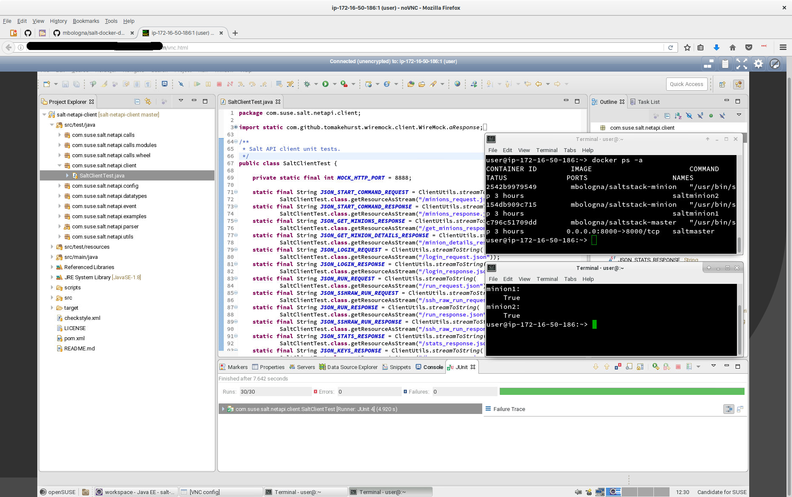

# suseq

This [Terraform](https://www.terraform.io/) configuration is used to set up a temporary development environment for code interviews at SUSE.



Name is a homage to [Creedence Clearwater Revival](https://www.youtube.com/watch?v=6BRMnrkbvso).

## Requirements

 - an AWS account, specifically an Access Key ID and a Secret Access Key
 - [an SSH key pair](http://docs.aws.amazon.com/AWSEC2/latest/UserGuide/ec2-key-pairs.html#having-ec2-create-your-key-pair) valid for that account

## Installation

OpenSUSE Leap 42.1:
```
sudo zypper addrepo http://download.opensuse.org/repositories/home:/SilvioMoioli:/tools/openSUSE_Leap_42.1/home:SilvioMoioli:tools.repo
sudo zypper install terraform
git clone https://github.com/moio/suseq.git
```

OpenSUSE Leap 42.2:
```
sudo zypper addrepo http://download.opensuse.org/repositories/home:/SilvioMoioli:/tools/openSUSE_Leap_42.2/home:SilvioMoioli:tools.repo
sudo zypper install terraform
git clone https://github.com/moio/suseq.git
```

OpenSUSE Tumbleweed:
```
sudo zypper addrepo http://download.opensuse.org/repositories/home:/SilvioMoioli:/tools/openSUSE_Tumbleweed/home:SilvioMoioli:tools.repo
sudo zypper install terraform
git clone https://github.com/moio/suseq.git
```

SUSE Linux Enterprise 12 SP1:
```
sudo zypper addrepo http://download.opensuse.org/repositories/home:/SilvioMoioli:/tools/SLE_12_SP1/home:SilvioMoioli:tools.repo
sudo zypper install terraform-provider-libvirt
git clone https://github.com/moio/suseq.git
```

Ubuntu and Debian:
```
wget http://download.opensuse.org/repositories/home:/SilvioMoioli:/tools/SLE_12_SP1/x86_64/terraform.rpm
sudo alien -i terraform.rpm
git clone https://github.com/moio/suseq.git
```

## Configuration

Copy `variables.tf.example` to `variables.tf` and complete all variables. If you skip this variables will be asked interactively every time a `terraform` command is called.

## Use

Refer to the [official guides](https://www.terraform.io/docs/index.html) for a general understanding of Terraform and full commands.

For a very quick start:
```
terraform get # populates modules
terraform plan # show the provisioning plan
terraform apply # bring up your systems, fasten your seatbelts!
```

When Terraform has finished bringing up the machine on AWS it will output an URL to connect to via your browser.
Share it with the interviewee.

Password for members who control the screen is `interview`.
Password for view-only public is `audience`.

To destroy and re-create the whole environment use:

```
terraform taint -module=aws_eclipse_host aws_instance.instance
terraform apply
```

## Timings

Please note that bringing up this machine on AWS will take roughly 25 minutes (based on our testing). Plan accordingly.
